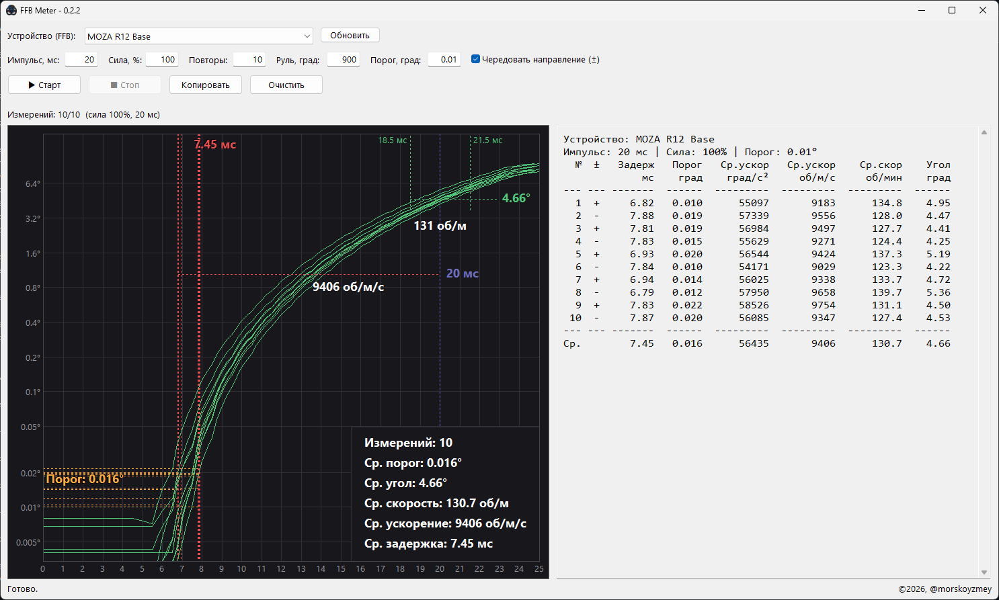

# FFB Meter
Измерение отклика DirectDrive рулевой базы. 

Программа измеряет задержку начала движения и развиваемые за короткий фиксированный импульс средние скорость и ускорение. Проводится N измерений и выводятся таблица и графики результатов измерений.



## Параметры по умолчанию
- Импульс: 20 мс
- Сила: 100%
- Угол: 900° (диапазон в драйвере)
- Повторы: 6 (количество измерений)
- Порог: 0.01° (изменение угла, считающееся началом движения)
- Чередовать направление: Да (направление тестового импульса)

## Особенность
FFBMeter центрует руль перед каждым импульсом и в конце измерений. 

**Сначала - руки прочь - потом жми Старт!**

## Методика
Задержка считается как время, прошедшее от конца вызова функции DirectInput, содержащей команду на импульс, до момента, когда полученное значение угла поворота вала базы превысило заданный Порог.

Хотя Порог начала движения задаётся пользователем (по умолчанию 0.01°), но он также учитывает калибровку шума энкодера, определяющего угол поворота вала базы. 
Потому значение Порога от измерения к измерению может меняться. Сам шум детектируется в течение 300 мс до начала движения, при том на графике визуально шум может отсутствовать, а эти 300 мс на график не попадают. 

Значение измеренного уровня шума влияет на порог так: final_thr = max(noise * 1.5, thr). 

Средняя скорость считается за последние 25% промежутка отрезка: от начала движения по Порогу до конца Импульса.

Ускорение считается так: Средняя скорость / время фактического движения от Порога до конца Импульса.

Опрос драйвера на предмет текущего положения вала происходит каждые 0.25 мс. На графике каждая оранжевая точка (кружок) это значение угла, которое вернул драйвер в этот момент времени.

Зеленый график это сглаженная интерполяция ступенчатых данных. По нему считается средняя скорость.

На графике - горизонтальная ось - миллисекунды, вертикальная - градусы. Масштаб оси угла логарифмический.

## Заметки
У PXN VD4 шум 24-битного энкодера значительно ниже порога 0.01°.

Частота, с которой драйвер отдает новое значение положения вала, от базы к базе может быть разной. Обычно раз в 1 мс (4 точки образуют ступеньку), но бывает значение плавает до 3 мс (такое было у базы R3). Это значительно влияет на детекцию начала движения, в меньшей степени на измеренную конечную скорость.

Если зеленый график имеет видимый прогиб где-то в середине импульса и при этом частота обновления угла около 1 мс - у вас люфт квик-релиза. Как это? Сперва вал базы начал набирать скорость, а через пару миллисекунд столкнулся с квикрелизом руля и замедлился, тем самым нарушив плавный набор скорости. На квик можно намотать немного фум ленты.

Оказывается, некоторые базы проявляют разную мощность в зависимости от направления вращения. Тест это очевидным образом выявляет за счет поочередной смены направления.


## Управление
- Старт - начать измерения.
- Стоп - прервать измерения.
- Копировать - скопировать в буфер обмена результаты измерений в табличном формате (разделитель - табуляция).
- Очистить - очистить результаты измерений.

Листать графики на колесико.

## Важно
Выставлять градусы как в драйвере (900 по умолчанию), иначе неверный диапазон сломает расчеты.
Фокус должен быть на окне программы, иначе джиттерит центровка, что может вызвать лишние вибрации на этапе замера шума.

## Мотивация
Нестабильность результатов тестов в RFRWheelTest.exe (в частности из-за методики измерения, конфликтующей с алгоритмом софт лока) и недостаточная точность и неудобство WheelCheck.exe.

Данный тест фокусируется на одной задаче (значимой по мнению автора): измерение отклика базы на короткий импульс, имитирующий срыв. 
Автор не видит смысла в измерении вертолетных свойств баз. 
Автор хотел получить очевидные и стабильные результаты измерений и их усредненные значения, которые можно сравнивать между базами без подгонки.


## Протестированные устройства
- Moza R3
- Moza R12v2
- Moza R16U
- Moza R21U
- Moza R25U
- Simucube 2 Pro (без ULL)
- Simagic Alpha
- Simagic Alpha EVO
- PXN VD4

Значения измерений здесь не приводятся, т.к. они проводились на этапе формирования методики измерений и с разными рулями и штурвалами.
Делиться результатами измерений Автор предлагает в Issues, в соответствующей теме в формате: 
База (версия прошивки) + какой штурвал/руль. 
Текст из окна лога + скриншот - идеальный вариант:
```text
Moza R12V2 (1.2.8.18) + KS Pro

Устройство: MOZA R12 Base
Импульс: 20 мс | Сила: 100% | Порог: 0.01°
  №  ±   Задерж   Порог   Ср.ускор   Ср.ускор    Ср.скор    Угол
             мс    град    град/с²     об/м/с     об/мин    град
--- --- -------  ------  ---------  ---------  ---------  ------
  1  +     4.80   0.022      60739      10123      153.8    7.91
  2  -     6.02   0.012      59775       9963      139.2    6.45
  3  +     6.07   0.026      61817      10303      143.5    6.65
  4  -     6.09   0.025      59536       9923      138.0    6.50
  5  +     5.90   0.035      62008      10335      143.2    6.65
  6  -     5.22   0.037      58690       9782      142.2    7.18
--- --- -------  ------  ---------  ---------  ---------  ------
Ср.        5.68   0.026      60427      10071      143.3    6.89
```

